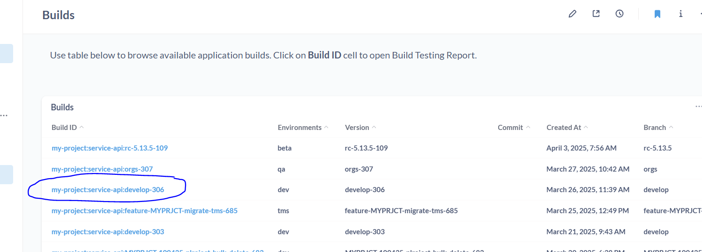
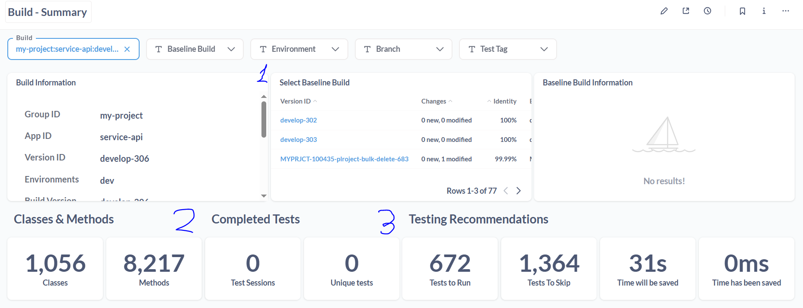
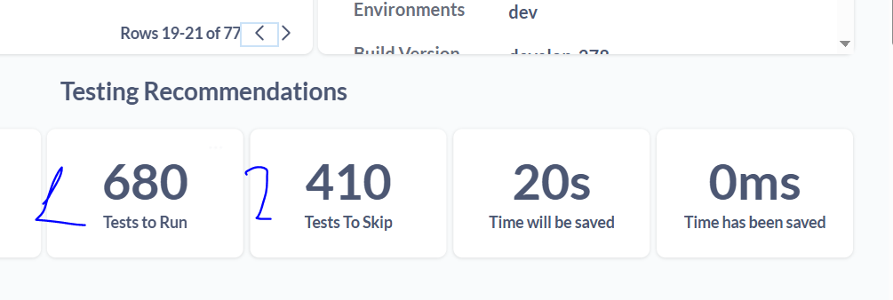
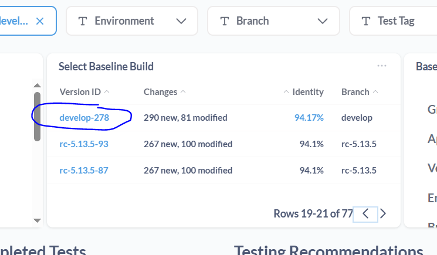
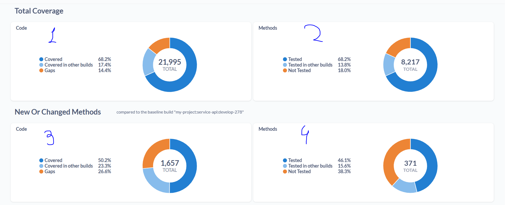
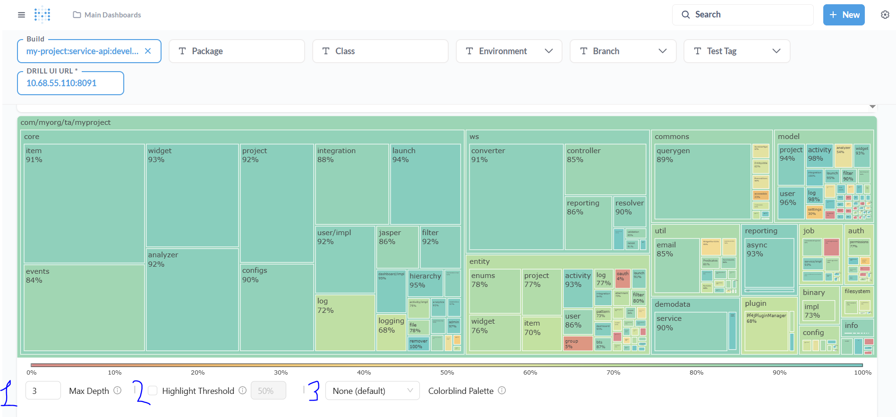
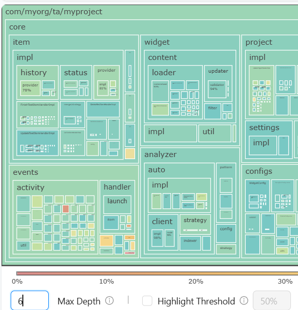
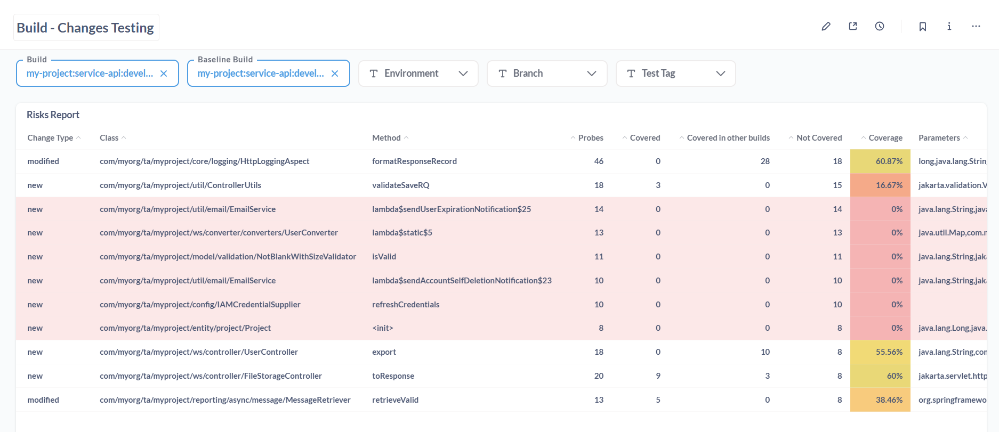

# Drill4J Demo

## Prepare:
1. **Login to Metabase**  
   [http://10.68.55.110:8095/](http://10.68.55.110:8095/)  
   `login:` user@user.user  
   `passw:` useruser1

2. **Login to Drill4J UI** *(necessary to serve custom charts in iframes)*  
   [http://10.68.55.110:8091/](http://10.68.55.110:8091/)  
   `login:` admin  
   `passw:` adminrp1

## Demo:

### Feature highlights:
- **Test-to-code Mapping** – See exactly how deeply and broadly tests interact with your application
- **Gap Analysis** – View insights built from data across all testing environments and stages  
- **Test Impact Analysis** – Get test recommendations for faster pipeline execution  
- **Risk Tracking** – Understand changes in a specific build and across versions  
- **Smart Coverage** – Access metrics aggregated from multiple versions  
- **Pull Request/Merge Request Reports** – Bring testing metrics closer to developers  
- **Trend Analysis** – Track how your testing effectiveness evolves over time  
- **Broad Test Type Support** – Collect metrics for any test type, including unit, API, E2E, and manual tests  

### 1. Home page - Builds

1. Open Metabase
   - [direct link](http://10.68.55.110:8095/)
2. Default home page displays a list of application versions. These are builds from all of testing environments monitored by Drill4J agents.
3. To navigate to build page click on the value in the first column

### 2. Build Summary Page

[direct link](http://10.68.55.110:8095/dashboard/2?baseline_build=&branch=&build=my-project%3Aservice-api%3Adevelop-306&environment=&test_tag=)

This page contains top-down view for the metrics collected for particular application version (aka "build").

Page header contains filters for Environment, Branch and Test Tag that allows to build fine-grained reports.
   

Next, there is a basic information, such as number of classes/methods in the respective build.

Pay attention to the following:
1. `"Select Baseline Build"` view (#1 on the screenshot above):
   1. Provides a list of other application builds against which currently selected build can be compared.
   2. __Make sure__ to set baseline build to enable diffrence-based metrics.
   3. To set baseline build, click on the value in the first column to set baseline build.
   4. Builds are sorted in reverse chronological order - navigate to older builds using page controls, to get compare versions that are likely more different.

2. `Completed Tests` view (#2 on the screenshot above)
   1. Displays number of test sessions and unique tests (distinct, w/o repetitions). On this particular screenshot there are none, since for this build no tests were executed yet. 

3. `Testing Recommendations` view (#3 on the screenshot above) 🚩***Unique feature*** 🚩
   1. This feature allows users to get recommendations on which tests should be executed and which could be skipped.
   2. `Tests To Run` - displays number of tests required to be executed to likely cover changes in current version.
   3. `Tests To Skip`- displays number of tests that could be skipped, since they likely wont test changes introduced in this version.
   4. `Time will be saved` - estimate of how much time will be saved if test recommendations are employed
      - > __NOTE__: this value displays particular quirk of this demo setup - it contains data from real testing environment. Here we had only unit tests context is integrated. Metrics are still captured from all test stages (API, manual, e2e ui, etc), but they do not contributed to test recommendations yet. If they would, this number would've contain hours instead of seconds for API tests alone
   5. `Time saved`- real metric of how much time is saved by using test recommendations.
   6. Clicking on either `Tests To Run` or `Tests To Skip` numbers will navigate you to the respective page with actual tests.
      
      > This information is also consumable __via API __and is used by __Drill4J CI/CD Plugin for Maven/Gradle__ (see below)
   7. Drill4J provides [CI/CD plugin for Maven/Gradle](https://drill4j.github.io/docs/cicd-integration/cicd-integration-plugin) to automate use of testing recommendations with ease (just a few config lines to save you a lot of pipeline time)

Lets now pick baseline build (e.g. develop-278, [direct link](http://10.68.55.110:8095/dashboard/2?baseline_build=my-project%3Aservice-api%3Adevelop-278&branch=&build=my-project%3Aservice-api%3Adevelop-306&environment=&test_tag=))

scroll down the page.

The following charts provide birds-eye view on how extensively application version is tested:

1. `Total Coverage - Code` (#1 on the screenshot above)
   1. This pierchart represents the whole application codebase from the perspective of __probes__ inserted into each class and method.
   2. You can think of __probes__ as execution counters for lines of code, but __more granular__ (there can be multiple probes on the same codeline).
   3. `Covered` - code tested in current build
   4. `Covered in other builds` - 🚩 *Unique feature* 🚩 - Drill4J is able to intelligently aggregate testing data from previous application version. It "knows" that certain parts of your codebase weren't changed since the last time they were tested. So it reuses these metrics to provide more complete picture.
   5. `Gaps` - code that was not tested __anywhere__, even in past application versions.
2. `Total Coverage - Methods` (#2 on the screenshot above)
   1. This metric is very similar to `Total Coverage - Code`, but instead of counting probes, it counts methods.
3. `New or Changed - Code` (#3 on the screenshot above) -  🚩 *Unique feature* 🚩
   1. Displays number of changes in code compared to the selected `Baseline Build`, and whether these changes were tested or not
4. `New or Changed - Methods` (#4 on the screenshot above) - 🚩 🚩 *Unique feature* 🚩 🚩 
   1. Displays number of new or changed __methods__ in comparison to `Baseline Build`
   2. __This is a must-have feature__ during testing and release process.
   3. Imagine the following scenario: 
      1. It's the end of the sprint, you are preparing to release new app version.
      2. You simply compare new version to the previous release and, __in an instant__ get the feedback if there are some parts of app you missed.
      3. And this includes information from all test stages, and even _manual tests_, which are often executed across weeks and multitude of versions and are almost impossible to take into account using traditional test coverage tools.
      4. Ideally, you want this chart to contain no untested methods prior to release.

Click on the piechart `Total Coverage - Methods` (#2 on screenshot, click one of the segments, it does not matter on which one) to navigate to next page

### 3. Build - Code Coverage

[direct link](http://10.68.55.110:8095/dashboard/3?branch=&build=my-project%3Aservice-api%3Adevelop-306&class=&drill_ui_url=10.68.55.110%3A8091&environment=&package=&test_tag=)

Once page is loaded, scroll down past the basic version information. You should see the card with spinning indicator, that will eventually render treemap (typically this takes around 5-10 seconds).

🗺️ **Treemap** this chart provides detailed and easily navigatable picture on application coverage. Once again, you can filter this dashboard by Environment, Branch and Test Tag (the latter one is not employed in this demo though):

1. At the top, each segment represents `Package`, with children packages nested within:
   1. Area of the segment corresponds to the number of probes, hence the number of code lines. Bigger area - bigger package
   2. Color represents coverage %. See the legend below the chart for reference. In short - red is not covered, yellow is 50% covered, blue-green is 100% covered
2. Segments are clickable:
   1. Clicking on the segment zooms in. It allows to eventually reach `Classes` and methods.
   2. Hovering on the segment displays detailed information on name, size and coverage in % in absolute numbers of probes
   3. Clicking on the root segment navigates back 1 level
3. Control bar at the bottom of the page contains:
   1. `Max depth` (#1) - adjust value from 2 to 10 to make view more granular to see more nested packages
      
   2. 🎯 `Highlight Threshold` (#2) - activate to highlight only packages/classes/methods covered below set percentage. Its an easy way to spot under-tested areas of your app.
      - Try increasing max depth to a higher value (e.g. 6) and enable highligh threshold to instantly see what you have missed in testing
      
   3. `Colorblind palette` - adjust for colorblindness if necessary 

### 4. Build - Changes Testing

Lets now navigate back to Build Summary Page ([direct link](http://10.68.55.110:8095/dashboard/2?baseline_build=my-project%3Aservice-api%3Adevelop-278&branch=&build=my-project%3Aservice-api%3Adevelop-306&environment=&test_tag=)).

Once its loaded, scroll down and click on New Or Changed - Methods piechart (see #1 on the image below)

This will navigate you to Build - Changes Testing page ([direct link](http://10.68.55.110:8095/dashboard/5?baseline_build=my-project%3Aservice-api%3Adevelop-278&branch=&build=my-project%3Aservice-api%3Adevelop-306&environment=&test_tag=))

This brief but helpful page contains list of new or changed methods:
1. These are sorted by number of not covered probes.
2. That means you are going to see the least tested changes on the top.   
3. As you perform your tests, you can refer to this page to ensure you have sufficiently tested all changes.

### 4. App summary page

[direct link](http://10.68.55.110:8095/dashboard/7-apps-summary-trends?app=service-api&baseline=my-project%3Aservice-api%3Adevelop-233&branch=develop&environment=&group=my-project)

Lastly, there is a page that displays testing trends across application versions. It is accessible using sidebar -> Apps Summary & Trends link. (#1 on the screenshot below)

Be sure to set __4 filters__: Group (`my-project`), App (`service-api`), Branch (e.g. `develop`) and Baseline (e.g. `develop-233`, you can type `233` into search bar to find it)

1. Chart 1 - Coverage by Builds

   1. X Axis displays last N application versions in chronological order. Each dot on the line is app version. The last one is the most recent. 
   2. Y Axis displays coverage %
   3. `Covered` (#1 on screenshot above) - coverage collected in _concrete application version_, across all deployments.
   4. `Covered in other builds` (#2 on screenshot above) - coverage mapped from versions previous to the version in question
   5. 🚩 *Unique feature* 🚩 - pay attention to the gap between `Covered` and `Covered in other builds`:
      1. Size of this gap, if observed consistently across versions, indicates tests that are not repeated consistently.
      2. These are tests that were executed sometime in the past, but not on the version in question.
      3. One source of such gap could be manual tests, if your app is way to big to perform complete manual testing on each version (which is often the case)

2. Chart 2 - Changes by Builds - Methods

   1. X Axis displays last N application versions in chronological order. Each dot on the line is app version. The last one is the most recent. 
   2. Y Axis displays number of __New or Changed Methods__ compared to `Baseline Build` set in the page header.
   3. Pay attention to the gap 1 (#1 on the screenshot) and gap 2 (#2 on the sceenshot)
      1. 🎯 Gap 1 - `Total Methods` (new or changed) minus `Tested in other builds` - this gap indicated how many of new or changed methods were not tested at all, not executed even once.
      2. 🎯 Growth of this gap is an indicator of testing being unable to catch up with rate of change. Simply speaking, you are introducing a lot of change and not testing it properly due to some factor (e.g. due to understaffed QA team)
      3. Gap 2 - tests that aren't repeated consistently. 

3. Chart 3 - Changed by Builds - Code

It is very similar to Chart 2 described above, but represented in number of Probes, rather than methods

### 5. Other features

1. GitHub Pull Request & GitLab Merge Request reports

   Drill4J provides step-by-step integration guide ([direct link](https://drill4j.github.io/docs/cicd-integration/github)) to integrate metrics into each Pull Request

2. Drill4J support almost all major application servers. For complete list check our documentation and repository 

### Links
1. Drill4J Documentation https://drill4j.github.io/docs/cicd-integration/github
2. Telegram Channel https://t.me/drill4j
3. Github https://github.com/Drill4J/drill4j

---

## FAQ:

### 1. Does Drill4J support manual tests?  
Yes. Drill4J collects coverage metrics for any code execution.  
However, **Test Recommendations for manual tests are not available** yet.
> This is doable, but requires custom development.

### 2. Does Drill4J require access to codebase / Git?  
For JVM-based apps, **Drill4J Application Agent extracts info from runtime**, no Git access required.  
> Drill4J CI/CD plugin does extract Git metadata (commit id, date, author)

### 3. How does test-to-code mapping work?
For JVM-based tests, **Drill4J Test Agent adds trace info to requests/messages during tests**.  
This is captured by Drill4J Application Agent.  
Drill4J supports tracing for:
- HTTP  
- WebSockets  
- message bus systems (e.g., Kafka)

### 4. Does test-to-code mapping work for test tool X / framework X?  
Drill4J provides support for:
- All major Java testing frameworks (JUnit, TestNG, JMeter, Selenide and even Cucumber)
- Selenium (Java)  
- Playwright (JavaScript)
- Postman
If no out-of-the-box solution exists, custom development is an option.
